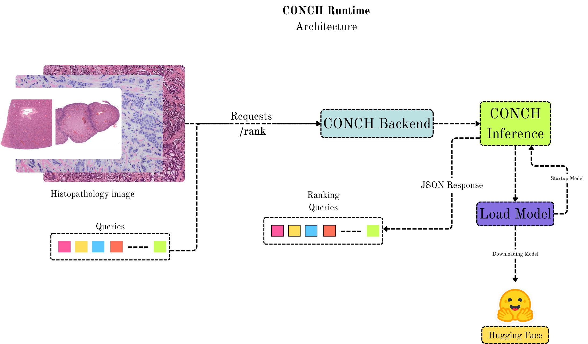

# Architecture Overview

CONCH Runtime wraps the CONCH vision-language model in a small FastAPI service. A caller submits a pathology image and candidate text queries; the runtime loads the model, computes image-text similarity, and returns a ranked JSON response.

  

## Request lifecycle

1. A client sends an image and candidate queries to the CONCH backend with `POST /rank`.
2. The backend validates the Base64 payload, converts the image to RGB, and applies the model preprocessing pipeline.
3. CONCH Inference encodes the image and queries in the shared embedding space, then ranks the queries by similarity.
4. The backend returns JSON containing the model name, rank, query, similarity score, and query-relative probability.

The runtime exposes `GET /ping` as a readiness check. It reports that the worker is still initializing until the model is loaded, then reports readiness for inference. Initialization failures are surfaced as an unavailable service so a load balancer does not route traffic to an unhealthy worker.

## Model loading

At startup, the runtime first uses the exact file supplied by `CONCH_CHECKPOINT_PATH`. If no local checkpoint is configured, Hugging Face loading is available only when `ALLOW_MODEL_DOWNLOAD=true`. The model cache and access token are configured through the variables documented in the [deployment guide](deployment.md).

## Service boundaries

- The HTTP service supports image-to-text ranking only.
- Caption generation is available through the Python model API and is not an HTTP endpoint.
- CONCH does not directly return bounding boxes or segmentation masks.
- Similarity probabilities are normalized across the submitted query list and are not calibrated clinical probabilities.

See the [API reference](api.md) for the wire contract and the [model guide](model.md) for feature extraction, captioning, and localization details.
